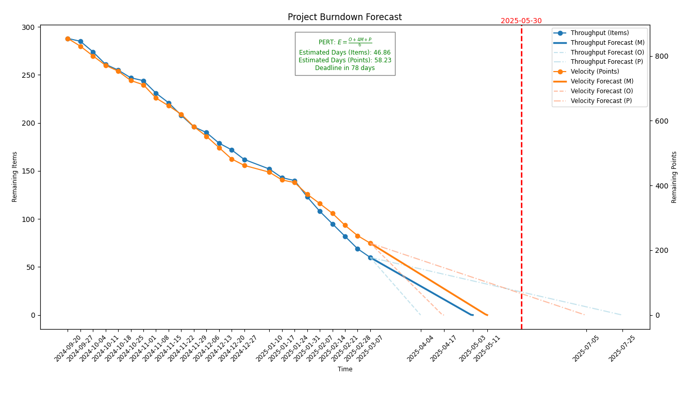

# Burndown Chart Generator

[](https://www.python.org)
[](LICENSE)

This project generates a burndown chart for project management using Python and Matplotlib.

## Installation

1. Install Python 3.13+ from the [official website](https://www.python.org).

2. Clone the repository:

    ```sh
    git clone https://github.com/niksavis/burndown-chart.git
    cd burndown-chart
    ```

3. Create a virtual environment and activate it:

    ```sh
    python -m venv .venv
    .venv\Scripts\activate  # On macOS and Linux use `source .venv/bin/activate`
    ```

4. Install the required dependencies:

    ```sh
    python -m pip install -r requirements.txt
    ```

## Usage

You can display detailed help by running:

```sh
python burndown.py --help
```

### Single Burndown

To generate a single burndown chart, use the `single` subcommand followed by five arguments:

```sh
python burndown.py single <items_val> <story_points_val> <throughput_val> <velocity_val> <deadline_str_val>
```

- `<items_val>`: Total number of backlog items.
- `<story_points_val>`: Total number of story points.
- `<throughput_val>`: Weekly throughput (items completed per week).
- `<velocity_val>`: Weekly velocity (story points completed per week).
- `<deadline_str_val>`: Deadline in `YYYY-MM-DD` format.

Example:

```sh
python burndown.py single 73 348 8 22 2025-05-29
```

The generated burndown chart will be saved as [`burndown_chart.svg`](burndown_chart.svg).

### Multiple Burndown

To generate multiple burndown charts at once, use the `multi` subcommand followed by repeated groups of six arguments:

```sh
python burndown.py multi <dataset_name> <items_val> <story_points_val> <throughput_val> <velocity_val> <deadline_str_val> ...
```

Each group corresponds to one dataset:

- `<dataset_name>`: A label/name for the dataset.
- `<items_val>`: Total number of items for this dataset.
- `<story_points_val>`: Total number of story points.
- `<throughput_val>`: Weekly throughput (items completed per week).
- `<velocity_val>`: Weekly velocity (story points completed per week).
- `<deadline_str_val>`: Deadline in `YYYY-MM-DD` format.

Example:

```sh
python burndown.py multi "Team A" 70 344 10 26 2025-05-29 "Team B" 122 488 15 46 2025-05-29
```

The generated multiple burndown chart will be saved as [`multiple_burndown_chart.svg`](multiple_burndown_chart.svg).

## Forecast

To generate a forecast using historical data, run:

```sh
python forecast.py <total_items> <total_points> <deadline> [--stats_file <path>] [--pert_factor <n>]
```

- `<total_items>`: Total number of items to complete.
- `<total_points>`: Total number of points to complete.
- `<deadline>`: Deadline in `YYYY-MM-DD` format.
- `--stats_file <path>`: Path to statistics CSV (default: `statistics.csv`).
- `--pert_factor <n>`: Number of largest/smallest samples for PERT (default: 3).

Example:

```sh
python forecast.py 50 200 2025-5-30 --stats_file statistics.csv --pert_factor 3
```

## Example

Here is an example of the generated burndown chart:


Here is an example of the generated multiple burndown chart:


Here is an example of the generated forecast chart:



## License

This repository is licensed under the [MIT License](LICENSE)

**[⬆ Back to Top](#burndown-chart-generator)**
