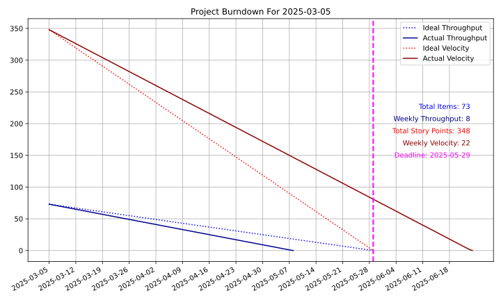
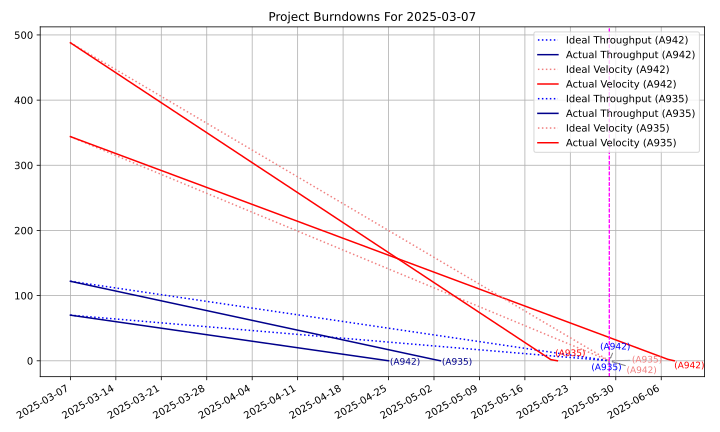
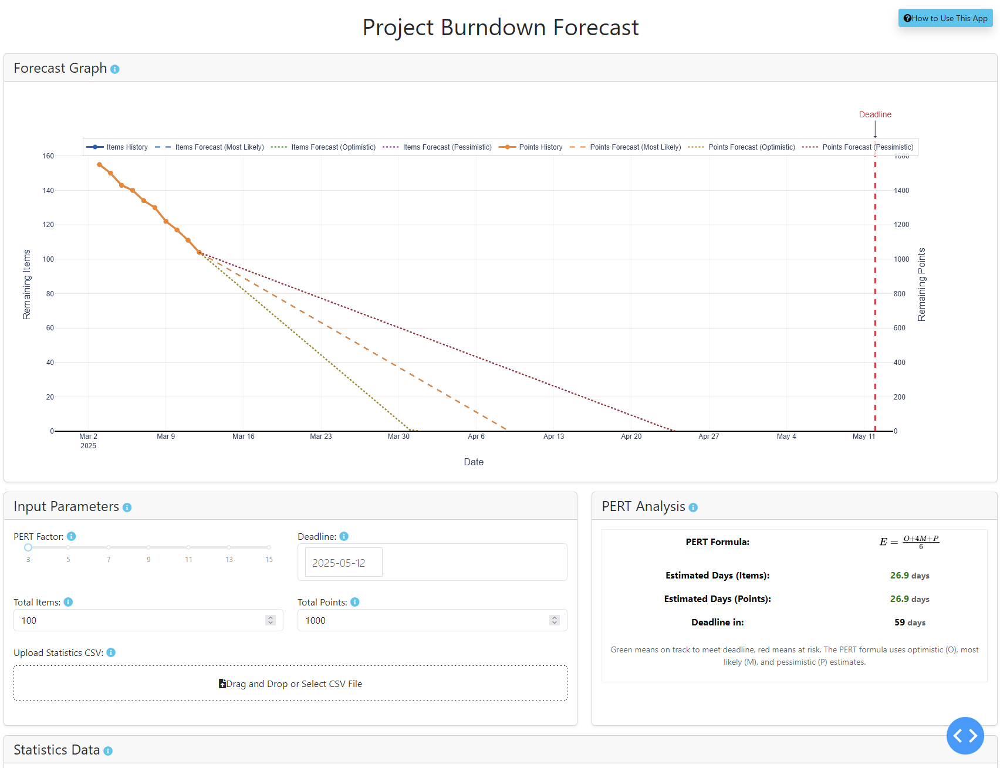

# Burndown Chart Generator

[](https://www.python.org)
[](LICENSE)

This project generates burndown charts and forecasts for project management using Python.

## Installation

1. Install Python 3.13+ from the [official website](https://www.python.org).

2. Clone the repository:

    ```sh
    git clone https://github.com/niksavis/burndown-chart.git
    cd burndown-chart
    ```

3. Create a virtual environment and activate it:

    ```sh
    python -m venv .venv
    .venv\Scripts\activate  # On macOS and Linux use `source .venv/bin/activate`
    ```

4. Install the required dependencies:

    ```sh
    python -m pip install -r requirements.txt
    ```

## Burndown Chart (Static)

You can display detailed help for the basic burndown script by running:

```sh
python burndown.py --help
```

### Single Burndown

To generate a single burndown chart, use the `single` subcommand followed by five arguments:

```sh
python burndown.py single <items_val> <story_points_val> <throughput_val> <velocity_val> <deadline_str_val>
```

- `<items_val>`: Total number of backlog items.
- `<story_points_val>`: Total number of story points.
- `<throughput_val>`: Weekly throughput (items completed per week).
- `<velocity_val>`: Weekly velocity (story points completed per week).
- `<deadline_str_val>`: Deadline in `YYYY-MM-DD` format.

Example:

```sh
python burndown.py single 73 348 8 22 2025-05-29
```

The generated burndown chart will be saved as [`burndown_chart.svg`](burndown_chart.svg).

### Multiple Burndown

To generate multiple burndown charts at once, use the `multi` subcommand followed by repeated groups of six arguments:

```sh
python burndown.py multi <dataset_name> <items_val> <story_points_val> <throughput_val> <velocity_val> <deadline_str_val> ...
```

Each group corresponds to one dataset:

- `<dataset_name>`: A label/name for the dataset.
- `<items_val>`: Total number of items for this dataset.
- `<story_points_val>`: Total number of story points.
- `<throughput_val>`: Weekly throughput (items completed per week).
- `<velocity_val>`: Weekly velocity (story points completed per week).
- `<deadline_str_val>`: Deadline in `YYYY-MM-DD` format.

Example:

```sh
python burndown.py multi "Team A" 70 344 10 26 2025-05-29 "Team B" 122 488 15 46 2025-05-29
```

The generated multiple burndown chart will be saved as [`multiple_burndown_chart.svg`](multiple_burndown_chart.svg).

## Interactive Burndown Forecast

The project includes an interactive web-based burndown forecast tool that provides more advanced features than the static burndown charts.

### Running the Forecast App

Launch the interactive forecast application with:

```sh
python app.py
```

Then open your web browser and navigate to: `http://127.0.0.1:8050/`

### Forecast App Features

The forecast application offers several advanced features:

#### Input Parameters

- **PERT Factor**: Determines how many data points to use for optimistic and pessimistic estimates (range: 3-15).
- **Deadline**: Set your project deadline date.
- **Estimated Items**: Number of items that have been estimated with points.
- **Total Items**: The total number of work items to be completed.
- **Estimated Points**: Sum of points for the items that have been estimated.
- **Total Points**: Automatically calculated based on estimated items/points or historical data.

#### Data Management

- **CSV Upload**: Import historical data from a CSV file.
- **Interactive Table**: View, edit, add, and delete data directly in the application.

#### Forecast Visualization

The app generates an interactive burndown chart with:

- **Historical Data**: Shows actual progress to date.
- **Multiple Forecast Scenarios**:
  - Most likely forecast (based on average throughput)
  - Optimistic forecast (based on best performance)
  - Pessimistic forecast (based on worst performance)
- **PERT Analysis**: Shows estimated completion dates using the Program Evaluation and Review Technique.
- **Deadline Tracking**: Visual indicators show if you're on track to meet your deadline.
- **Project Metrics**: Displays key metrics including:
  - Total Items and Points (displayed as whole numbers)
  - Deadline and days remaining
  - Estimated completion days for Items and Points
  - Average Weekly Items/Points (from last 10 weeks)
  - Median Weekly Items/Points (from last 10 weeks)
- **Export Options**: Save your chart as a PNG image with the filename format `burndown_forecast_YYYYMMDD.png`.

### CSV Format for Historical Data

Your CSV file should contain the following columns:

- `date`: Date of work completed (YYYY-MM-DD format)
- `no_items`: Number of items completed on that date
- `no_points`: Number of points completed on that date

Example CSV:

```text
date;no_items;no_points
2025-03-01;5;50
2025-03-02;7;70
```

The file can use semicolon (;) or comma (,) as separators.

### Sample Data

A sample data file (statistics.csv) is included in the repository with historical data spanning multiple months. You can use this file to test the forecast app:

1. Launch the forecast app as described above

2. Find the "Upload Statistics CSV" section in the Input Parameters card

3. Simply drag and drop the statistics.csv file into the upload area

4. The app will automatically load the data and generate a forecast

The sample data contains real-world project statistics that demonstrate how the forecast works with sustained progress over time.

## Examples

The repository includes example images showing the output of both the static and interactive tools.

Here is an example of the generated static single burndown chart:



Here is an example of the generated static multiple burndown chart:



Here is an example of the interactive forecast application:



## Troubleshooting

- **Missing dependencies**: Ensure you've installed all required packages using the commands listed in the installation sections. The static charts require matplotlib and adjustText, while the interactive forecast requires dash, dash-bootstrap-components, plotly, and pandas.

- **CSV upload issues**: Check that your CSV format matches the example format. The sample statistics.csv file is known to work correctly.

- **Image rendering**: If SVG images don't render in your browser, try opening them in a dedicated image viewer or graphics application.

- **Data persistence**: The application automatically saves your settings and statistics data to `forecast_settings.json` and `forecast_statistics.csv` in the application directory. If you experience issues with saved data, try deleting these files to reset to defaults.

- **Port conflicts**: If you get an error that port 8050 is already in use, either close the other application using that port or modify the app.run_server() line in forecast_app.py to use a different port. For example:

```py
# Run the app
if __name__ == "__main__":
    app.run_server(debug=True, port=8060)
```

## License

This repository is licensed under the [MIT License](LICENSE)

**[⬆ Back to Top](#burndown-chart-generator)**
