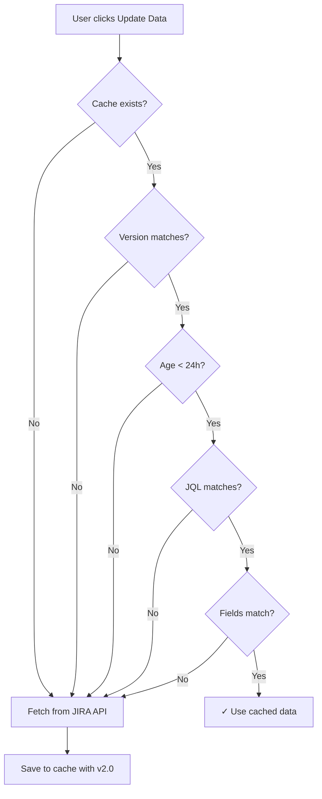

# JIRA Cache Versioning and Expiration Implementation

**Date**: October 25, 2025  
**Feature**: 006-ux-ui-redesign  
**Issue**: Cache invalidation for pagination updates and stale data prevention

---

## Problem Statement

### Original Issue
After implementing pagination to fetch ALL JIRA issues (not just first 1000), users with existing cache files were still seeing old data:
- **Expected**: 2500 issues from JIRA  
- **Actual**: 1000 issues (from old cache before pagination)

### Root Cause
The cache validation logic only checked:
- ✅ JQL query matches
- ✅ Fields requested match  
- ✅ File size within limits

But **NEVER checked**:
- ❌ Cache version (pagination vs non-pagination format)
- ❌ Cache age (stale data from days/weeks ago)
- ❌ Code changes that affect cache structure

This meant **old caches persisted indefinitely**, causing incorrect data to be displayed.

---

## Solution: Cache Versioning + Expiration

### Implementation Overview

Added two-layer cache invalidation strategy:

1. **Version-based invalidation** - Detects format/logic changes
2. **Time-based expiration** - Prevents stale data

### Code Changes

#### 1. Cache Version Constant (`data/jira_simple.py`)

```python
# Cache version - increment when cache format changes or pagination logic changes
CACHE_VERSION = "2.0"  # v2.0: Pagination support added

# Cache expiration - invalidate cache after this duration
CACHE_EXPIRATION_HOURS = 24  # Cache expires after 24 hours
```

**Version History**:
- `v1.0` (implicit): Original non-paginated fetch (max 1000 issues)
- `v2.0`: Pagination support - fetches ALL issues automatically

#### 2. Enhanced Cache Storage (`cache_jira_response()`)

**Before**:
```python
cache_data = {
    "timestamp": datetime.now().isoformat(),
    "jql_query": jql_query,
    "fields_requested": fields_requested,
    "issues": data,
    "total_issues": len(data),
}
```

**After** (with versioning):
```python
cache_data = {
    "cache_version": CACHE_VERSION,  # NEW: Track cache format version
    "timestamp": datetime.now().isoformat(),
    "jql_query": jql_query,
    "fields_requested": fields_requested,
    "issues": data,
    "total_issues": len(data),
}
```

#### 3. Enhanced Cache Validation (`load_jira_cache()`)

Added three new validation checks:

**A. Version Check** (prevents incompatible cache formats):
```python
cached_version = cache_data.get("cache_version", "1.0")
if cached_version != CACHE_VERSION:
    logger.info(
        f"Cache version mismatch. Cached: v{cached_version}, Current: v{CACHE_VERSION}. "
        f"Cache invalidated (pagination or format changed)."
    )
    return False, []
```

**B. Age Check** (prevents stale data):
```python
cache_timestamp = datetime.fromisoformat(cache_data.get("timestamp"))
cache_age = datetime.now() - cache_timestamp
if cache_age > timedelta(hours=CACHE_EXPIRATION_HOURS):
    logger.info(
        f"Cache expired. Age: {cache_age.total_seconds() / 3600:.1f} hours "
        f"(max: {CACHE_EXPIRATION_HOURS} hours). Cache invalidated."
    )
    return False, []
```

**C. Enhanced Logging** (better visibility):
```python
cache_age_str = f"{(datetime.now() - cache_timestamp).total_seconds() / 3600:.1f}h old"
logger.info(
    f"✓ Loaded {len(issues)} JIRA issues from cache "
    f"(v{cached_version}, {cache_age_str}, JQL: {cached_jql})"
)
```

---

## How It Works

### Cache Lifecycle



### Invalidation Scenarios

| Scenario                          | Cache Version | Cache Age | JQL Query | Result                               |
| --------------------------------- | ------------- | --------- | --------- | ------------------------------------ |
| Old cache (pre-pagination)        | v1.0          | Any       | Matches   | ❌ **INVALIDATED** - Version mismatch |
| New cache but stale               | v2.0          | 25h old   | Matches   | ❌ **INVALIDATED** - Expired          |
| New cache, fresh, same query      | v2.0          | 2h old    | Matches   | ✅ **USED** - Valid cache             |
| New cache, fresh, different query | v2.0          | 2h old    | Different | ❌ **INVALIDATED** - Query mismatch   |

---

## Benefits

### 1. **Automatic Stale Data Prevention**
- Cache expires after 24 hours
- Ensures users get fresh data from JIRA regularly
- Prevents showing outdated ticket counts/statuses

### 2. **Safe Code Updates**
- Version bump forces cache invalidation
- Future pagination improvements won't break existing caches
- No manual cache deletion required after updates

### 3. **Developer-Friendly**
- Clear version history in code comments
- Explicit logging shows why cache was invalidated
- Easy to adjust expiration policy (change `CACHE_EXPIRATION_HOURS`)

### 4. **User Transparency**
- Log messages clearly indicate cache status:
  - `"Cache version mismatch... Cache invalidated"`
  - `"Cache expired. Age: 25.3 hours... Cache invalidated"`
  - `"✓ Loaded 2500 issues from cache (v2.0, 2.5h old)"`

---

## Testing

### Test Scenario 1: Old Cache (Pre-Pagination)

**Setup**: Delete cache, create old v1.0 cache manually
```powershell
# Simulate old cache
$old_cache = @{
    timestamp = (Get-Date).AddHours(-5).ToString("o")
    jql_query = "project = KAFKA"
    fields_requested = "key,created,status"
    issues = @(1..1000)  # Only 1000 issues
    total_issues = 1000
} | ConvertTo-Json -Depth 10
$old_cache | Out-File "jira_cache.json"
```

**Expected Behavior**:
1. User clicks "Update Data"
2. Cache validation detects version mismatch (no `cache_version` field = v1.0)
3. Cache invalidated automatically
4. Fresh fetch with pagination retrieves all 2500 issues
5. New cache saved with `"cache_version": "2.0"`

**Log Output**:
```
Cache version mismatch. Cached: v1.0, Current: v2.0. Cache invalidated (pagination or format changed).
Fetching JIRA issues from: https://jira.example.com/rest/api/2/search
Query matches 2500 total issues, fetching all with pagination...
Fetching page starting at 0 (fetched 0 so far)
Fetching page starting at 500 (fetched 500 so far)
...
✓ Pagination complete: Fetched all 2500 of 2500 JIRA issues
Cached 2500 JIRA issues to jira_cache.json (v2.0, JQL: project = KAFKA)
```

### Test Scenario 2: Expired Cache

**Setup**: Create cache that's 25 hours old
```powershell
# Simulate expired cache
$expired_cache = @{
    cache_version = "2.0"
    timestamp = (Get-Date).AddHours(-25).ToString("o")
    jql_query = "project = KAFKA"
    fields_requested = "key,created,status"
    issues = @(1..2500)
    total_issues = 2500
} | ConvertTo-Json -Depth 10
$expired_cache | Out-File "jira_cache.json"
```

**Expected Behavior**:
1. User clicks "Update Data"
2. Cache validation detects age > 24 hours
3. Cache invalidated automatically
4. Fresh fetch retrieves latest data (may now have 2600 issues)

**Log Output**:
```
Cache expired. Age: 25.1 hours (max: 24 hours). Cache invalidated.
Fetching JIRA issues from: https://jira.example.com/rest/api/2/search
Query matches 2600 total issues, fetching all with pagination...
```

### Test Scenario 3: Valid Cache

**Setup**: Recent cache with matching query
```powershell
# User clicks "Update Data" twice within 24 hours
```

**Expected Behavior**:
1. First click: Fetches from JIRA, saves cache
2. Second click (within 24h): Uses cached data

**Log Output**:
```
✓ Loaded 2500 JIRA issues from cache (v2.0, 2.5h old, JQL: project = KAFKA, Fields: key,created,status)
JIRA data import successful: 2500 issues loaded, 48 weekly data points created
```

---

## Configuration

### Adjusting Cache Expiration

To change how long cache is valid, edit `data/jira_simple.py`:

```python
# Cache expiration - invalidate cache after this duration
CACHE_EXPIRATION_HOURS = 24  # Change this value
```

**Recommended values**:
- **24 hours** (default): Good balance for daily development
- **1 hour**: For rapidly changing JIRA projects
- **72 hours**: For stable projects with infrequent changes
- **0.5 hours**: For testing/debugging (30 minutes)

### Forcing Cache Refresh

Users can force fresh data fetch by:

**Option 1**: Delete cache file
```powershell
Remove-Item "jira_cache.json"
```

**Option 2**: Wait for expiration (24 hours by default)

**Option 3**: Change JQL query (even slightly)
```
# Old: project = KAFKA
# New: project = KAFKA ORDER BY created
```

---

## Future Enhancements

### Potential Improvements

1. **User-configurable expiration**
   - Add cache expiration setting to JIRA Configuration modal
   - Allow per-project cache policies

2. **Cache statistics**
   - Show cache age in UI
   - Display "Last fetched: 2.5 hours ago" badge
   - Add manual "Refresh from JIRA" button

3. **Partial cache updates**
   - Fetch only new issues since last cache
   - Use JIRA's `updated >= "2025-10-25"` filter
   - Merge with existing cache for faster updates

4. **Smart expiration**
   - Shorter expiration during work hours (1 hour)
   - Longer expiration off-hours (24 hours)
   - Adjust based on issue velocity

---

## Files Modified

1. **`data/jira_simple.py`**
   - Added `CACHE_VERSION = "2.0"` constant
   - Added `CACHE_EXPIRATION_HOURS = 24` constant
   - Updated `cache_jira_response()` to include version
   - Enhanced `load_jira_cache()` with version + age validation
   - Improved logging for cache operations

---

## Rollback Plan

If cache versioning causes issues:

1. **Revert to non-versioned cache**:
   ```python
   # Comment out version check in load_jira_cache()
   # if cached_version != CACHE_VERSION:
   #     return False, []
   ```

2. **Disable expiration**:
   ```python
   CACHE_EXPIRATION_HOURS = 999999  # Effectively infinite
   ```

3. **Complete rollback**: Restore `jira_simple.py` from git:
   ```powershell
   git checkout HEAD -- data/jira_simple.py
   ```

---

## Summary

✅ **Problem Solved**: Old caches no longer persist indefinitely  
✅ **Version Control**: Cache format changes automatically invalidate old caches  
✅ **Freshness**: 24-hour expiration ensures data stays current  
✅ **Transparency**: Clear logging shows cache decisions  
✅ **Future-Proof**: Version bumps enable safe code evolution  

**User Impact**: No more manual cache deletion needed - the system handles it automatically!
