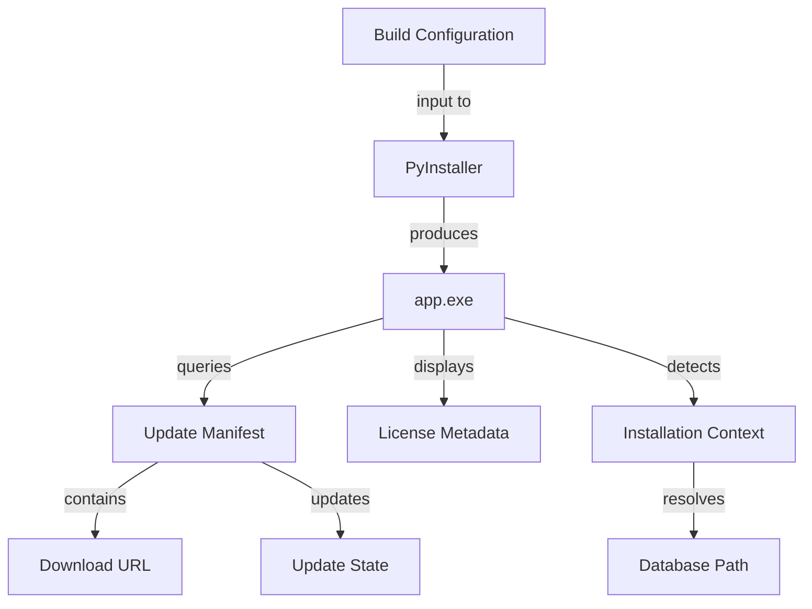

# Data Model: Standalone Packaging

**Feature**: 016-standalone-packaging  
**Date**: 2026-01-14

## Overview

This feature primarily involves build infrastructure rather than runtime data models. The entities below represent configuration structures and API responses used during the build/update process.

## Entities

### 1. Build Configuration

**Purpose**: Defines PyInstaller packaging settings for creating executables

**Structure** (YAML):
```yaml
app:
  name: "BurndownChart"
  version: "2.5.0"  # Read from bump_version.py
  entry_point: "app.py"
  icon: "assets/icon.ico"
  one_file: true  # Single-file executable
  console: true   # Show terminal window
  
dependencies:
  include_packages:
    - dash
    - plotly
    - waitress
    - pydantic
    # ... all production deps
  exclude_packages:
    - pytest
    - playwright
    - pip_tools
    - coverage
  
paths:
  output_dir: "dist/"
  build_dir: "build/"
  spec_file: "build/app.spec"
  
bundled_data:
  - source: "assets/"
    dest: "assets/"
  - source: "licenses/"
    dest: "licenses/"
```

**Validation Rules**:
- `version` must match format `X.Y.Z`
- `entry_point` file must exist
- `exclude_packages` must not be imported by production code
- All `include_packages` must be in requirements.txt

### 2. Update Manifest

**Purpose**: Describes available update from GitHub releases API

**Structure** (JSON):
```json
{
  "version": "2.6.0",
  "tag_name": "v2.6.0",
  "published_at": "2026-01-20T10:30:00Z",
  "prerelease": false,
  "assets": [
    {
      "name": "burndown-chart-windows-v2.6.0.zip",
      "browser_download_url": "https://github.com/owner/repo/releases/download/v2.6.0/burndown-chart-windows-v2.6.0.zip",
      "size": 95420160,
      "content_type": "application/zip"
    }
  ],
  "body": "## What's New\n\n- Feature X\n- Bug fix Y"
}
```

**Validation Rules**:
- `version` must be greater than current version (semver comparison)
- `assets` must contain exactly one Windows ZIP file
- `browser_download_url` must be valid HTTPS URL
- `size` should be <100MB (warning if exceeded)

**Source**: `https://api.github.com/repos/{owner}/{repo}/releases/latest`

### 3. License Metadata

**Purpose**: Describes bundled dependency licenses for compliance and display

**Structure** (Markdown Table):
```markdown
| Package  | Version | License             | URL                                 |
| -------- | ------- | ------------------- | ----------------------------------- |
| dash     | 3.1.1   | MIT                 | https://github.com/plotly/dash      |
| plotly   | 6.0.1   | MIT                 | https://github.com/plotly/plotly.py |
| waitress | 3.0.2   | Zope Public License | https://github.com/Pylons/waitress  |
```

**Generation**: `pip-licenses --format=markdown --with-urls --order=name`

**Validation Rules**:
- No GPL/AGPL licenses (blocks bundled distribution)
- All Apache 2.0 packages listed in NOTICE.txt
- URLs must resolve (no 404s)
- Each package in requirements.txt must appear

### 4. Installation Context

**Purpose**: Tracks runtime environment for portable installation

**Structure** (Runtime Object):
```python
@dataclass
class InstallationContext:
    executable_path: Path      # Full path to app.exe
    install_dir: Path          # Directory containing app.exe
    database_path: Path        # Resolved profiles/burndown.db path
    is_frozen: bool            # True if running from PyInstaller exe
    is_portable: bool          # True if database in same dir as exe
    version: str               # Current app version
    
    @classmethod
    def detect(cls):
        """Auto-detect installation context"""
        if getattr(sys, 'frozen', False):
            # Running from executable
            exe_path = Path(sys.executable)
            install_dir = exe_path.parent
            is_frozen = True
        else:
            # Running from source
            exe_path = Path(__file__).resolve()
            install_dir = exe_path.parent
            is_frozen = False
        
        db_path = install_dir / 'profiles' / 'burndown.db'
        version = get_version()  # From bump_version.py
        
        return cls(
            executable_path=exe_path,
            install_dir=install_dir,
            database_path=db_path,
            is_frozen=is_frozen,
            is_portable=db_path.parent.parent == install_dir,
            version=version
        )
```

**Usage**:
- Database path resolution
- Update file paths
- Portable installation detection
- Debug logging

### 5. Update State

**Purpose**: Tracks update download/installation progress

**Structure** (Runtime State Machine):
```python
from enum import Enum

class UpdateState(Enum):
    IDLE = "idle"                          # No update activity
    CHECKING = "checking"                  # Querying GitHub API
    AVAILABLE = "available"                # Update found
    DOWNLOADING = "downloading"            # Downloading ZIP
    READY = "ready"                        # Downloaded, ready to install
    INSTALLING = "installing"              # Updater launched
    ERROR = "error"                        # Download/install failed
    UP_TO_DATE = "up_to_date"             # No update needed

@dataclass
class UpdateProgress:
    state: UpdateState
    current_version: str
    available_version: str | None = None
    download_url: str | None = None
    download_path: Path | None = None
    progress_percent: int = 0
    error_message: str | None = None
    last_checked: datetime | None = None
```

**State Transitions**:
```
IDLE → CHECKING → [AVAILABLE | UP_TO_DATE | ERROR]
AVAILABLE → DOWNLOADING → [READY | ERROR]
READY → INSTALLING → IDLE (after restart)
ERROR → IDLE (user dismisses or timeout)
```

**Persistence**: Not persisted (in-memory only). Check repeats on next launch.

## Relationships



## Database Schema Changes

**None Required**: This feature does not modify existing SQLite schema. All update state is in-memory. Installation context is derived at runtime.

## File System Structure

```
install_directory/
├── app.exe                    # Main executable
├── updater.exe                # Updater executable
├── licenses/                  # Bundled with executable
│   ├── LICENSE.txt
│   ├── NOTICE.txt
│   └── THIRD_PARTY_LICENSES.txt
└── profiles/                  # Created on first run
    └── burndown.db            # SQLite database
```

**Path Resolution Rules**:
1. Always resolve relative to `sys.executable` when frozen
2. Fall back to `__file__` when running from source
3. Create `profiles/` directory if missing
4. Never hard-code absolute paths

## Validation & Invariants

### Build-Time Validation
- All dependencies have compatible licenses
- Excluded packages not imported by production code
- Version number matches across all files
- Icon file exists and is valid .ico format

### Runtime Validation
- Database directory is writable
- Update download has valid checksum (if provided)
- Downloaded ZIP contains expected files (app.exe, updater.exe)

### Constraints
- Executable size <100MB (warning threshold)
- Update check timeout: 2 seconds
- Update download timeout: 5 minutes
- Updater must complete within 30 seconds

## Migration Strategy

**None Required**: No database migrations. Feature adds new runtime behavior without changing existing data structures.

---

**Status**: ✅ Complete - All entities defined with structures, validation rules, and relationships.
